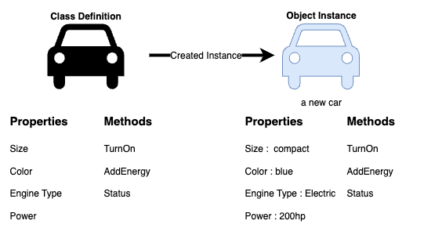
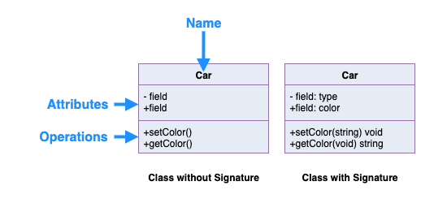
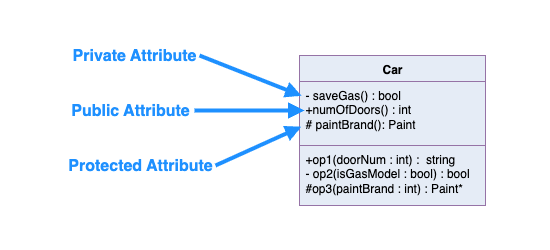
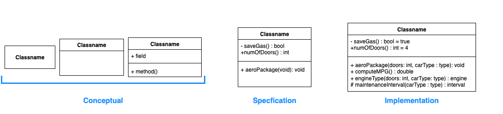
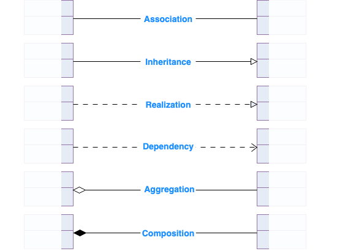

# UML - Unified Modeling Language

## What is a Class?
A class is like a set of blueprints. It defines the structure and behavior of something, but it isn’t the actual thing itself. In object-oriented programming, we use classes to create objects. The object is the thing that lives and operates in your program. It holds data and performs actions but it’s the class that defines what kind of object it is, and what it’s capable of doing.

You can think of a class as a design, and objects as real-world instances of that design. Every object built from the same class has the same components: properties (state) and methods (behavior). This relationship is at the heart of object-oriented design. It’s not really about the objects themselves, but about the structure (the class) that makes those objects possible.

## Example
Let’s take a car as an example. A class might define a generic ‘Car’ with a set of attributes and behaviors. When we create a specific car say, a blue electric compact car, that’s an object: a concrete instance of the Car class.

A car has properties which describe the car - size, color, Engine Type, Power as well as behaviors - TurnOn, Add Energy, and status. An object is an instance of a class.



## UML Class Notation
In UML, a class represents an idea or concept that bundles together both **data (attributes)** and **functionality (methods or operations)**. Each attribute has a specific data type (like `String`, `Int`, `Double`, etc.), and each method has a defined signature.  Meaning its name, parameters, and return type. The only thing that’s truly required is the class name, but adding attributes and methods gives the full picture.



### Class Name:
* The class name goes in the top section of the UML box.
* This is the only thing that’s required, it’s the identity of your class.

### Class Attributes:
* Attributes (also called properties or fields) are listed in the second section.
* Each attribute shows its name followed by a colon and its type (like color: String).
* These represent the member variables you’d see in code.

### Class Operations (Methods):
* Methods go in the third section. This is where the class shows what it can do.
* The return type of each method is listed after the colon at the end of the method.
* If a method takes parameters, their types are listed too (like setColor(color: String): void).
* These map directly to your class’s public functions or internal logic.


## Class Visibility
The +, - and # symbols before an attribute and operation name in a class denote the visibility of the attribute and operation.



* `+` denotes public attributes or operations
* `-` denotes private attributes or operations
* `#` denotes protected attributes or operations

# Parameter Directionality
Each parameter in an operation (method) may be denoted as **in**, **out** or **inout** which specifies its direction with respect to the caller. This directionality is shown before the parameter name.


|  **Keyword**  | **Direction** | **What it Means** |
|:----------:   |:----------:   |----------         |
| `in`          | Input         | The method uses the value passed in, but doesn’t change it.|
| `out`         | Output        | The method doesn’t use the parameter as input, but sets it before returning.|
| `inout`       | Both          | The method uses the parameter and may modify it before returning|

### Example

Let’s say you have this in a UML diagram:

```csharp
+calculateDiscount(in price: Double, out discount: Double)
```

That tells us:
* The method needs a price as input.
* It computes a `discount`, which gets returned via the `discount` parameter.

If it were `inout discount: Double`, then:
*  The method could read and update the value of `discount`.

As oppose to:
```csharp
+calculateDiscount(in price: Double, in discount: Double) : int
```
* Both `price` and `discount` do not get changed, and the function returns a new `int` value. 

## Perspectives of Class Diagram
How you draw or interpret a class diagram depends on where you are in the development process.

At the very beginning, like when you’re building a domain model, you’re usually focused on the conceptual side, just identifying key ideas or real-world things your system needs to know about.

Once you’re deeper into the analysis phase, you might start blending conceptual and specification perspectives. This is where you not only define what things are, but also what kind of behavior or interfaces they expose.

As you shift into actual software design, your focus moves toward the implementation perspective, where you care about the specifics of how classes work under the hood, how data is stored, and how methods are built out.

### The Three Perspectives:
* **Conceptual** – High-level view of the domain. Focuses on real-world concepts, not code.
* **Specification** – Focuses on the software’s interfaces (like what methods a class exposes).
* **Implementation** – Gets into the actual class design, data structures, and logic.

The deeper you go, the more detail your diagram shows. But at the end of the day, the only thing you have to include is the class name, everything else depends on how much you want to communicate at that stage.



## Relationships between classes
A well-defined UML diagram can be directly mapped to actual code, making it easier to maintain the original design intent throughout implementation.

In this section, we’ll look at the different types of relationships that can exist between classes. If you’re not familiar with them yet, no worries. That’s exactly what this part is for.

Each class in your diagram can be connected to other classes through one or more relationships. These relationships represent how objects interact, depend on, or use each other — and they often translate directly into patterns in your programming language.

Here are the main types of class relationships you’ll see in UML:



