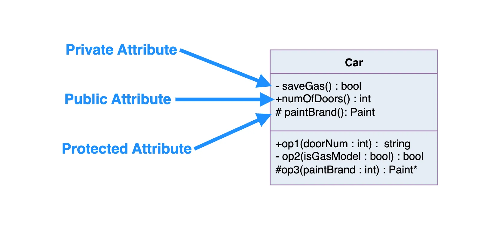

# UML - Unified Modeling Language

## What is a Class?
A class is like a set of blueprints. It defines the structure and behavior of something, but it isn’t the actual thing itself. In object-oriented programming, we use classes to create objects. The object is the thing that lives and operates in your program. It holds data and performs actions but it’s the class that defines what kind of object it is, and what it’s capable of doing.

You can think of a class as a design, and objects as real-world instances of that design. Every object built from the same class has the same components: properties (state) and methods (behavior). This relationship is at the heart of object-oriented design. It’s not really about the objects themselves, but about the structure (the class) that makes those objects possible.

## Example
Let’s take a car as an example. A class might define a generic ‘Car’ with a set of attributes and behaviors. When we create a specific car say, a blue electric compact car, that’s an object: a concrete instance of the Car class.

A car has properties which describe the car - size, color, Engine Type, Power as well as behaviors - TurnOn, Add Energy, and status. An object is an instance of a class.


## UML Class Notation
In UML, a class represents an idea or concept that bundles together both **data (attributes)** and **functionality (methods or operations)**. Each attribute has a specific data type (like `String`, `Int`, `Double`, etc.), and each method has a defined signature.  Meaning its name, parameters, and return type. The only thing that’s truly required is the class name, but adding attributes and methods gives the full picture.


### Class Name:
* The class name goes in the top section of the UML box.
* This is the only thing that’s required, it’s the identity of your class.

### Class Attributes:
* Attributes (also called properties or fields) are listed in the second section.
* Each attribute shows its name followed by a colon and its type (like color: String).
* These represent the member variables you’d see in code.

### Class Operations (Methods):
* Methods go in the third section. This is where the class shows what it can do.
* The return type of each method is listed after the colon at the end of the method.
* If a method takes parameters, their types are listed too (like setColor(color: String): void).
* These map directly to your class’s public functions or internal logic.


## Class Visibility
The +, - and # symbols before an attribute and operation name in a class denote the visibility of the attribute and operation.



* `+` denotes public attributes or operations
* `-` denotes private attributes or operations
* `#` denotes protected attributes or operations

# Parameter Directionality
Each parameter in an operation (method) may be denoted as **in**, **out** or **inout** which specifies its direction with respect to the caller. This directionality is shown before the parameter name.


|  **Keyword**  | **Direction** | **What it Means** |
|:----------:   |:----------:   |----------         |
| `in`          | Input         | The method uses the value passed in, but doesn’t change it.|
| `out`         | Output        | The method doesn’t use the parameter as input, but sets it before returning.|
| `inout`       | Both          | The method uses the parameter and may modify it before returning|

### Example

Let’s say you have this in a UML diagram:

```csharp
+calculateDiscount(in price: Double, out discount: Double)
```

That tells us:
* The method needs a price as input.
* It computes a `discount`, which gets returned via the `discount` parameter.

If it were `inout discount: Double`, then:
*  The method could read and update the value of `discount`.

As oppose to:
```csharp
+calculateDiscount(in price: Double, in discount: Double) : int
```
* Both `price` and `discount` do not get changed, and the function returns a new `int` value. 

## Perspectives of Class Diagram
How you draw or interpret a class diagram depends on where you are in the development process.

At the very beginning, like when you’re building a domain model, you’re usually focused on the conceptual side, just identifying key ideas or real-world things your system needs to know about.

Once you’re deeper into the analysis phase, you might start blending conceptual and specification perspectives. This is where you not only define what things are, but also what kind of behavior or interfaces they expose.

As you shift into actual software design, your focus moves toward the implementation perspective, where you care about the specifics of how classes work under the hood, how data is stored, and how methods are built out.

### The Three Perspectives:
* **Conceptual** – High-level view of the domain. Focuses on real-world concepts, not code.
* **Specification** – Focuses on the software’s interfaces (like what methods a class exposes).
* **Implementation** – Gets into the actual class design, data structures, and logic.

The deeper you go, the more detail your diagram shows. But at the end of the day, the only thing you have to include is the class name, everything else depends on how much you want to communicate at that stage.


## Relationships between classes
A well-defined UML diagram can be directly mapped to actual code, making it easier to maintain the original design intent throughout implementation.

In this section, we’ll look at the different types of relationships that can exist between classes. If you’re not familiar with them yet, no worries. That’s exactly what this part is for.

Each class in your diagram can be connected to other classes through one or more relationships. These relationships represent how objects interact, depend on, or use each other — and they often translate directly into patterns in your programming language.

Here are the main types of class relationships you’ll see in UML:


## Inheritance (or Generalization):
Inheritance (or generalization) is all about creating a relationship where one class **builds on top of another**. It defines an **“is-a"** relationship meaning the child class *is a type of* the parent class.

Each subclass (or child class) **inherits** the properties and methods of its superclass (or parent class), but can also define its own specific behavior. So if you’ve got a Vehicle superclass, a Car subclass would inherit its core structure, but also add features like `openTrunk()` or `convertibleTop`.

In UML:
* The superclass is at the top, and subclasses branch from it.
* Abstract class names are shown in *italics*.
* The relationship is drawn as a **solid line** with a **hollow triangle arrowhead** pointing **upward to the parent class**.

So in the example below:
* `PowerController` and `Suspension` inherit from `Car`.
* That means they automatically have all of SuperClass’s attributes and methods (unless they override them).


## Association
An association in UML is a basic relationship between two classes. It shows that they’re connected in some way. You can think of it as a structural link between two objects that need to talk to each other or share data.

In diagrams, associations are drawn as a solid line between two classes. The line often has a verb or short phrase on it (like “manages” or “uses”) to describe what kind of relationship it is, ideally something that makes sense in the real-world domain you’re modeling.

A simple association is just a straight-up connection between two peer classes. One class may control or depend on the other, but they aren’t part of each other, they’re just related.

For example:
* `Class1` and `Class2` are connected.
* `Class1` might be a `<<control>> class` (like a controller or manager).
* `Class2` could be a `<<boundary>> class` (like a UI or API wrapper).
* The association is shown as a solid line with no arrow, just a clean link between the two.

This kind of relationship doesn’t imply ownership or hierarchy, it just means the two classes interact.


## Cardinality
Cardinality — also called **multiplicity** — defines **how many instances** of one class can be associated with another. It’s a key part of association lines in UML, and it answers questions like:
* Can one object be linked to just one other object?
* Can it be linked to many?
* Can many link to many?

### Common Cardinality Types
| **Type**  | **Notation**       | **What it Means** |
|---------- |--------------      |-------------------|
|One-to-One |1 to 1              |One instance of a class is connected to exactly one instance of another class.|
|One-to-Many|1 to 0..* or 1 to * |One instance connects to multiple instances of another class.|
|Many-to-Many|* to *             |Multiple instances of both classes can be connected to each other.|

### In Plain English
> * A one-to-one relationship might be:
> <Br>Each **User** has exactly one **Profile**
> <Br>(User 1 ----- 1 Profile)

> * A **one-to-many** relationship could be:
> <Br>One **Author** can write many **Books**
> <Br>(Author 1 ----- * Books)

> * A **many-to-many** relationship might be:
> <BR>Students enroll in many **Courses**, and each **Course** has many Students
> <Br>(Student * ----- * Course)

The graphic below summarizes the most common multiplicity options you’ll see on association lines.


> UML also supports custom cardinalities, like 3..5 or 0..10, if you want to define a more specific range.

## Aggregation
Aggregation is a **special kind of association** that represents a **“has-a”** or **“part-of”** relationship, but with a twist. It tells us that one class is made up of other classes, but the parts can still live on their own.

Here’s how to think about it:
* `Class2` is a part of `Class1`.
* You can have **many** instances of `Class2` connected to `Class1`.
* But here’s the key: if `Class1` is destroyed, `Class2` doesn’t necessarily go down with it - **they each have their own lifecycles**.

### In Plain English
Let’s say a Team has many `Players`:
```csharp
Team 1 ----- * Player
```
* The Player can exist even if the Team is deleted.
* A player could switch to another team, or exist without being on any team at all.

In UML diagrams, aggregation is drawn as a **solid line** with a **hollow diamond** on the end **closest to the “whole” or “container” class**.

So in this case, the diamond would be on the `Team` side, pointing toward `Player`:


## Composition
Composition is like **aggregation’s more intense sibling**, it also represents a “part-of” relationship, but with a much tighter bond.

The key difference?
If the whole is destroyed, the parts go down with it.

So:
* `Class2` is part of `Class1`, but it can’t exist on its own.
* If you delete an object of `Class1`, its `Class2` parts are also destroyed.
* The lifetimes of the objects are completely tied together.

In a UML class diagram:
* Composition is shown with a **solid line**
* And a **filled (black) diamond** at the end **connected to the “whole” class**

Meaning:

> An Order contains one or more OrderItems, and if the Order is deleted, all OrderItems go with it.


## Dependency
A **dependency** means that one class *uses* another, but only temporarily, like a one-off interaction inside a method. The dependent class doesn’t own or store the other one, it just calls on it when needed.

So:
* `Class1` depends on `Class2` if it calls a method from it, uses it as a parameter, or creates a temporary instance.
* This isn’t a long-term relationship, it’s more like borrowing a tool rather than owning it.

### When Does It Show Up?

If `Class1` uses `Class2` inside a method, but doesn’t store it in a field or return it. That’s a **dependency**.
```csharp
func void doSomething(service: Logger) {
    service.log("Just using this temporarily")
}
```
Here, `Logger` isn’t stored. `doSomething()` just uses it briefly, that’s dependency.

### Impact on Change

You also have a **dependency** if:
* A change in `Class2`’s interface (e.g. method name or signature) would force a change in `Class1`.
* But not the other way around, the relationship is one-directional.


## Realization
A **realization** is a relationship between an **interface** and the class that implements it. It’s like saying:

> “Here’s what I promise to do…”
> <Br>“…and here’s the class that actually does it.”

You can think of it as the link between a blueprint and the concrete implementation.

> Side note, concrete is the actual method being used, as opposed to `abstract` and/or `virtual` methods (depending on the language)

### Real World Example
Let’s say you have an interface called `Drivable`, which defines:
* `turnOnAC()`
* `driveTo(location: String)`

Now imagine you have two classes:
* `ElectricCar`
* `GasolineCar`

They both need to implement those methods, but they’ll do it in their own way. That’s a realization: both `ElectricCar` and `GasolineCar` realize the `Drivable` interface. Both `ElectricCar` and `GasolineCar` will at least implement `turnOnAC()` and `driveTo(location: String)`.

In UML:
* A realization is shown as a dashed line with a hollow triangle arrowhead.
* The arrow points from the implementing class to the interface.

This tells us:
> “Both `ElectricCar` and `GasolineCar` realizes `Drivable` — it promises to implement everything defined by the interface.”


--- 

# 🚗 UML Class Diagram Example: Car System


---

# Diverging from UML Class diagram
There are some items that are heavily used in development but don't show up in UMLs, such a enums (enumerations). Like any good tool, they are there to help us. This section, we free hand UML a bit to make it work for our needs.

## Enumerations

### UML Enum in Class Diagram Context

You can also show a class that uses the enum like this:


* This shows PowerController has an attribute state that uses the PowerState enum.
* The upward triangle ▲ is optional and can just represent dependency/use.

Since you’re building your own visual sheet, feel free to:
* Use a different background color (e.g. light yellow or green) for enums.
* Use italics or bold to style the enum values.
* Add a tiny icon or tag like E in the corner of the box if you want even faster visual scanning.